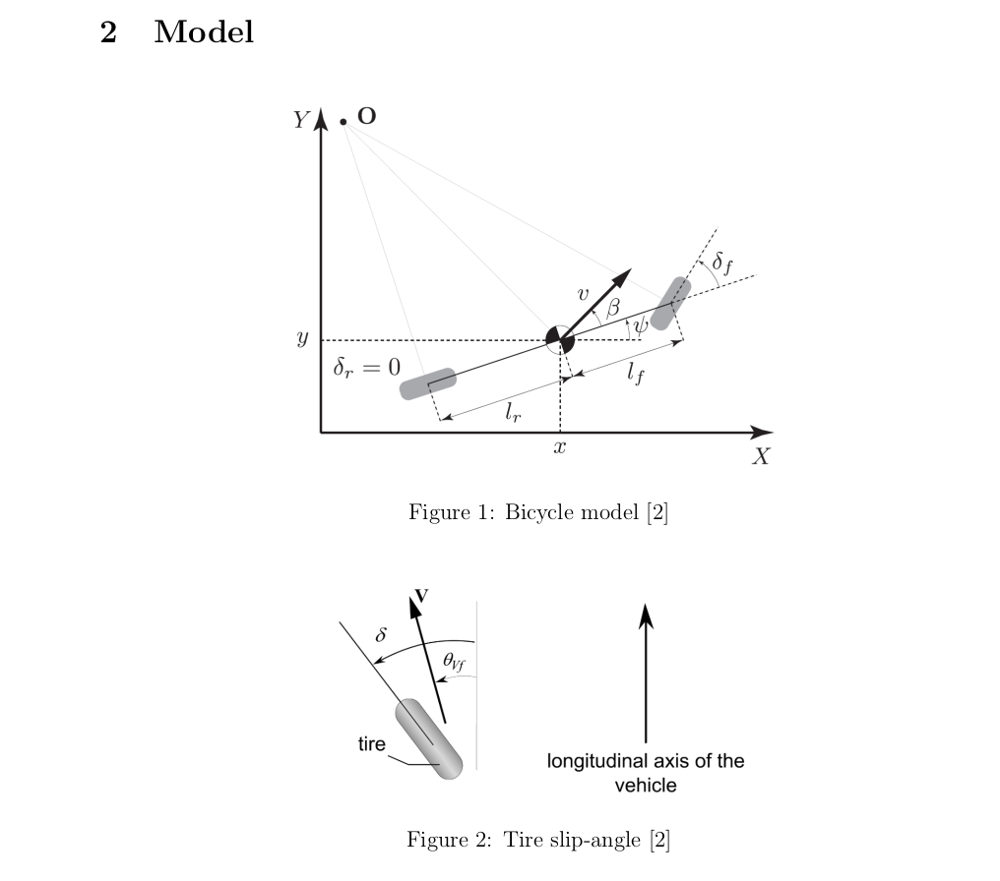
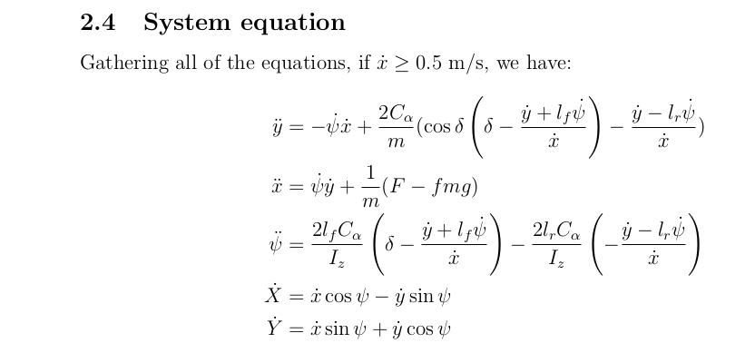
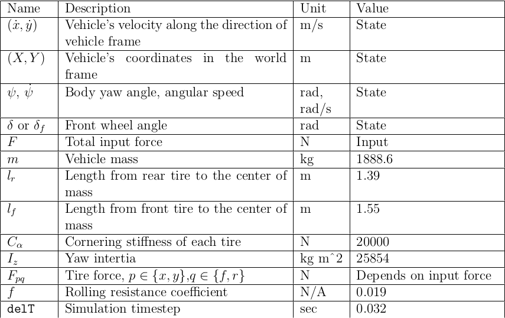
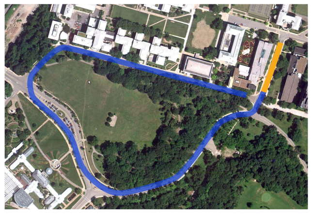

# Control-System-for-Self-Driving-Vehicle

Project for CMU - Modern Control Theory Course

## Overview

The Bicyle model used for the project:

**Part I**

State-space formulation of Bicyle model and linearization of system.

Design, Implementation and manual tuning of Lateral and Longitudinal PID controllers in Webots environment. 

System Equations and Model Parameters Used:

**Part II**

Designing a lateral full-state feedback controller.

**Part III**

Design and Tuning of lateral discrete infinite-horizon LQR Controller.

Implementation of A* path planning algorithm.

**Part IV**

Implementation of EKF SLAM to control the vehicle without default sensor input to estimate the position and heading of the vehicle..

Achieved lap time under 77 s for track of 1500 m length and cross track error less than 5m.

Track Used for simulation:

@author: Tanmay Chinchanikar. 

All the controller and planner codes were written as part of Modern Control Theory and Design course from scratch. Please refer to academic Integrity policy of CMU before using/referring these codes.

Note: The simulation environment used for this project is the "WEBOTS". Webots is a free and open-source 3D robot simulator. The environment and track setup was was done by the course staff. 

The Simulation Flow of the Webots Environment:

